

# Academy Backend/Frontend/QE Virtual MTY

### **Proyecto:** AWS

---

### **Desarrollador:** Sergio Servando Prado Lozano

---

### **Encargado:** Miguel Ángel Rugerio Flores

---

### **Lugar:** San Pedro de las Colonias Coahuila

### **Fecha:** 12/09/2026

---

# Semana 5 · Reporte de prácticas AWS

Este documento reúne los bloques de las dos guías. Las fechas de los encabezados corresponden al calendario del curso; las capturas registran cuándo se ejecutaron las actividades.

**Disponibilidad de los servicios.** Los recursos se levantaron para realizar las prácticas y registrar sus resultados. Todos los servicios utilizados ya se dieron de baja. El entorno se retiró por seguridad y para evitar costos. El repositorio público conserva la evidencia histórica; la aplicación ya no se ofrece como un servicio activo y las direcciones de las capturas no deben utilizarse como enlaces vigentes.

**Lectura de las evidencias.** Se conservan todas las imágenes y sus números de figura. Las capturas se presentan centradas, al pulsarlas se abre el archivo original para revisar los detalles. Cada pie explica qué se ve y por qué importa. Los estados Running, Available o de despliegue correcto corresponden al momento de la práctica, anterior a la baja de los servicios.

# Día 3 · Miércoles 9 · Fundamentos, EC2, S3, VPC y RDS

## La cuenta, segura

---

### MP-1 · Presupuesto antes que nada

#### ¿Qué se hizo?

Se creó el presupuesto `taskflow-5usd` en AWS Budgets con un monto de 5 USD al mes. Se configuraron tres alertas: gasto real superior al 85 %, gasto previsto superior al 100 % y gasto real superior al 100 %.

#### ¿Para qué sirve?

El presupuesto ayuda a comparar el gasto de los recursos con el monto planeado para el mes. Las alertas permiten detectar cuándo se supera un porcentaje del presupuesto o cuándo se calcula que el gasto podría rebasarlo.

#### ¿Qué se vio?

<a href="CapturasGuia1/mp-01-presupuesto.png">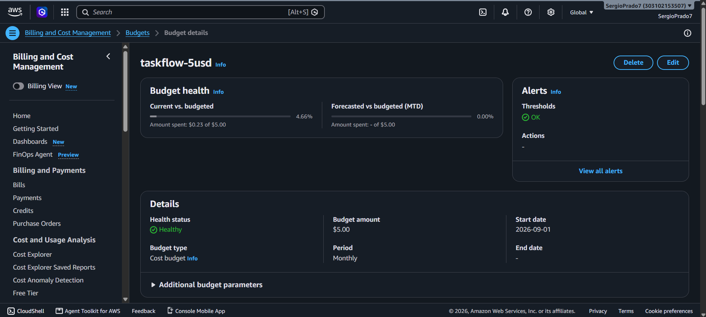</a>

> **Figura 1.** Presupuesto mensual de 5 USD. La consola muestra un gasto de 0.23 USD, equivalente al 4.66 %, y el estado Healthy. Permite comprobar el monto y el gasto respecto al presupuesto.

<a href="CapturasGuia1/mp-01-alertas.png">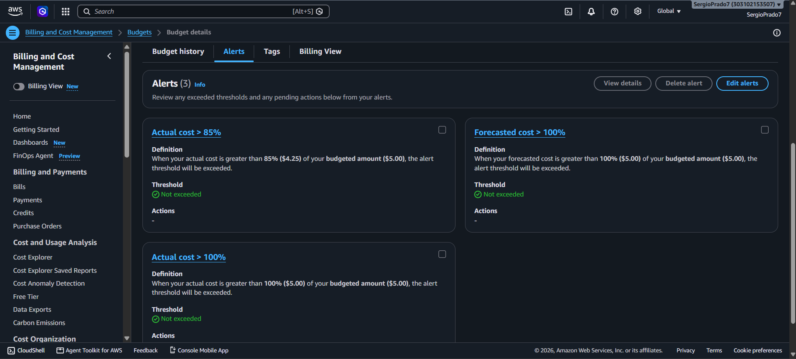</a>

> **Figura 2.** Las tres alertas configuradas aparecen con el estado Not exceeded: todavía no se había superado ninguno de sus umbrales. Permite comprobar los avisos configurados.

#### Resultado obtenido

El presupuesto quedó creado y se pudieron consultar tanto el gasto acumulado como las alertas. Se conservó la configuración mostrada en las capturas.

#### Alcance y limitaciones

Se completó la creación del presupuesto. Se conservaron las alertas de 85 % real, 100 % previsto y 100 % real por decisión del autor; no se ajustó el 85 % al 80 % de la guía.

---

### MP-2 · Asegurar la cuenta

#### ¿Qué se hizo?

Se comprobó que el acceso a la cuenta solicitaba un código de verificación MFA. También se creó el usuario IAM `taskflow-admin`, se obtuvo su dirección de acceso a la consola y se inició sesión con ese usuario. En la consola se seleccionó la región N. Virginia.

#### ¿Para qué sirve?

MFA agrega una segunda comprobación al iniciar sesión. IAM permite trabajar con usuarios y permisos propios, y la dirección de inicio de sesión permite entrar a la cuenta con el usuario creado.

#### ¿Qué se vio?

<a href="CapturasGuia1/mp-02-mfa.png">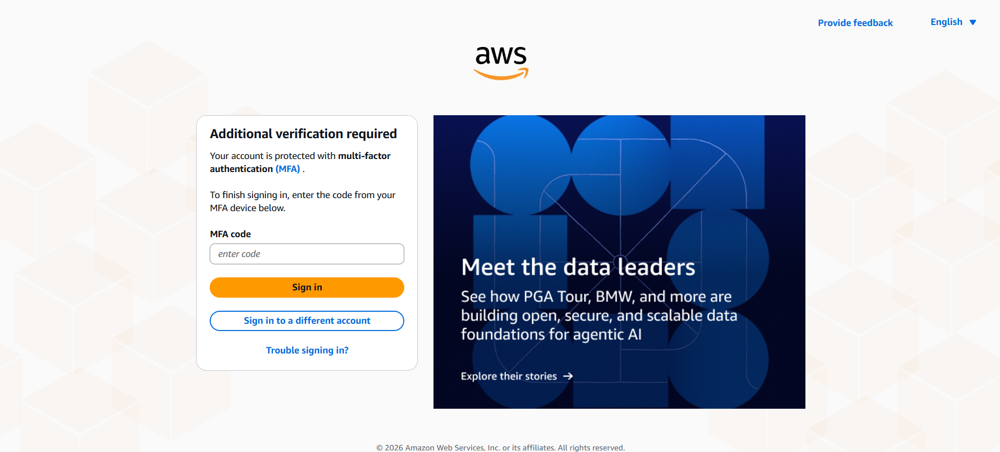</a>

> **Figura 3.** AWS solicita un código MFA para completar el inicio de sesión. Evidencia que el acceso solicita un segundo factor.

<a href="CapturasGuia1/mp-02-iam-user.png">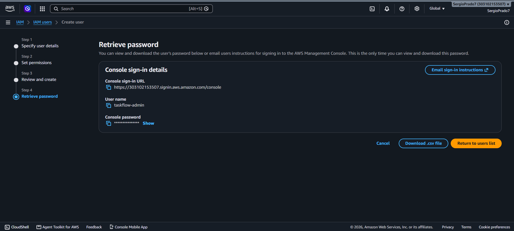</a>

> **Figura 4.** Pantalla final de creación de taskflow-admin, con la dirección de acceso a la consola y la contraseña oculta. Identifica el usuario preparado para acceder a la consola.

<a href="CapturasGuia1/mp-02-iam-user-semuestralosuserscreados.png">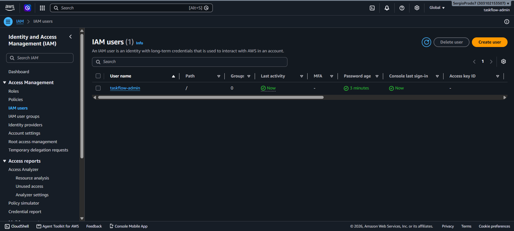</a>

> **Figura 5.** El usuario taskflow-admin aparece en la lista de usuarios IAM. Confirma que el usuario existe.

<a href="CapturasGuia1/mp-02-iam-user-sesioniniciadaconeluser-taskflow-admin.png">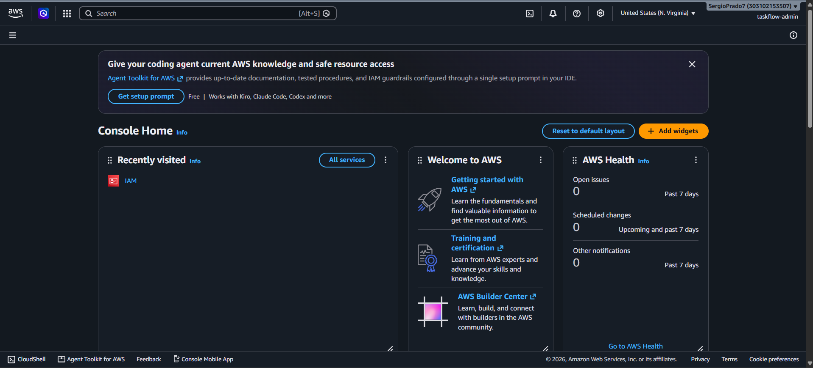</a>

> **Figura 6.** La consola muestra la sesión de taskflow-admin y la región N. Virginia. Permite identificar la sesión y región utilizadas.

#### Resultado obtenido

Se confirmó la solicitud de MFA durante el acceso y se logró entrar a la consola con `taskflow-admin`.

#### Alcance y limitaciones

Se comprobó MFA en el acceso y una sesión IAM. Las capturas posteriores muestran otra identidad en la consola; no se afirma que todas las operaciones se hayan realizado con taskflow-admin.

## EC2

---

### MP-3 · Lanzar la EC2

#### ¿Qué se hizo?

Se abrió EC2 y se lanzó una instancia llamada `taskflow-ec2`, de tipo `t3.micro`, con Amazon Linux 2023 y un volumen de 8 GiB. Durante la configuración se creó el par de claves RSA `taskflow-key` en formato `.pem` y se guardó el archivo en la carpeta local `conexion`.

#### ¿Para qué sirve?

EC2 proporciona la máquina virtual donde se ejecutará la API. La clave privada permite identificarse al conectar por SSH, mientras que la dirección IP pública permite localizar la instancia desde el equipo local.

#### ¿Qué se vio?

<a href="CapturasGuia1/mp-03-ec2-launchinstances.png">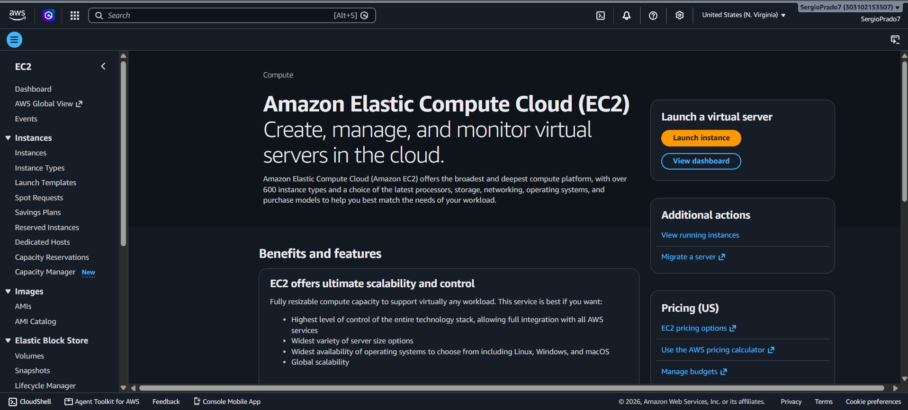</a>

> **Figura 7.** Pantalla de EC2 desde la que se inició la creación de la instancia. Ubica el servicio donde se aprovisionó la máquina.

<a href="CapturasGuia1/mp-03-taskflow-key.png">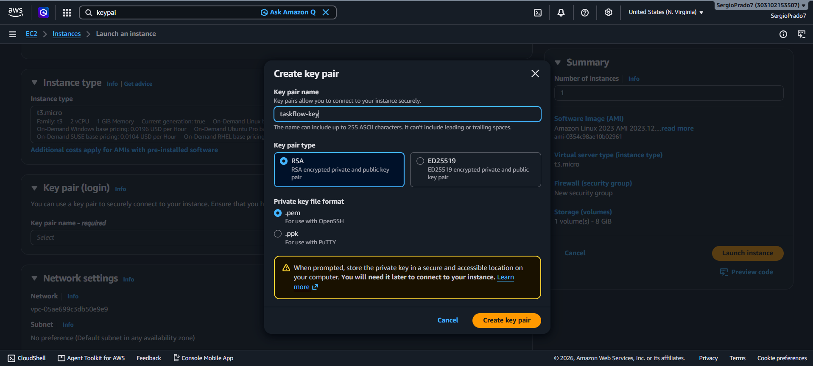</a>

> **Figura 8.** Creación de taskflow-key con tipo RSA y formato .pem. Al fondo se observa la configuración de la instancia. Documenta la preparación del mecanismo de acceso SSH.

<a href="CapturasGuia1/mp-03-llavecreada.png">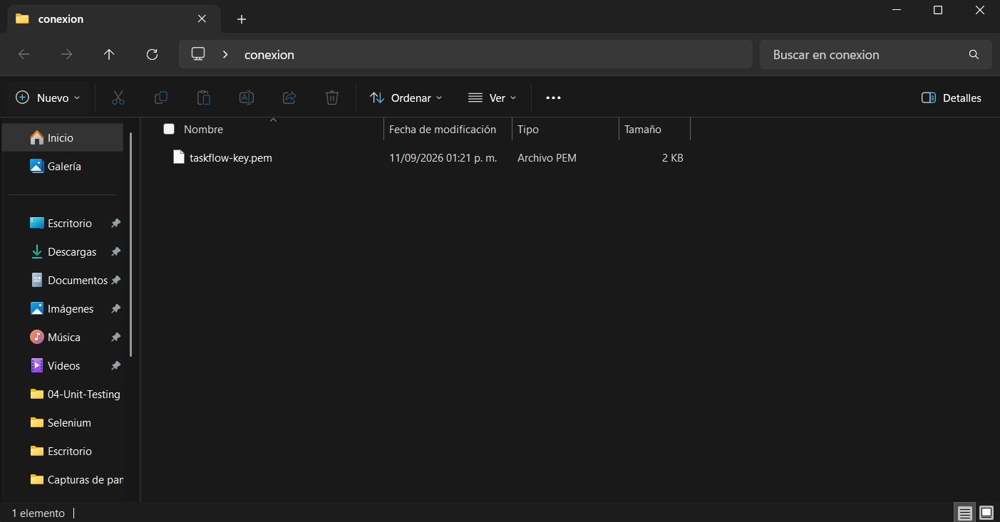</a>

> **Figura 9.** Archivo taskflow-key.pem guardado en la carpeta conexion. Confirma que la llave se descargó; no muestra su contenido.

<a href="CapturasGuia1/mp-03-instanciasrunning.png">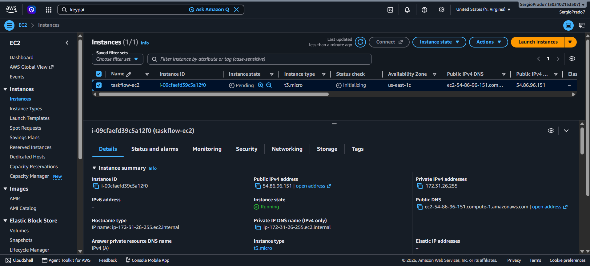</a>

> **Figura 10.** El panel de detalles muestra la instancia en estado Running y su dirección IPv4 pública. Confirma que se contó con un servidor encendido.

#### Resultado obtenido

La instancia quedó encendida y se contó con una clave privada para conectarse. El estado Running se observa en el panel inferior de detalles.

#### Alcance y limitaciones

Se documentó la instancia encendida. No se capturaron las reglas iniciales de SSH y 8080, por lo que sus valores no se presentan como verificados.

---

### MP-4 · Conectar por SSH

#### ¿Qué se hizo?

Desde Git Bash se ejecutó `chmod 400 taskflow-key.pem` para ajustar los permisos de la llave. Después se usó `ssh -i taskflow-key.pem ec2-user@<IP-publica>` y se aceptó la confirmación de la primera conexión.

#### ¿Para qué sirve?

SSH permite administrar la máquina de AWS desde una terminal local mediante una conexión cifrada. La opción `-i` indica qué llave se usará para la autenticación y `ec2-user` es el usuario con el que se accedió a Amazon Linux.

#### ¿Qué se vio?

> **Figura 11.** Comandos para ajustar los permisos de la llave e iniciar la conexión SSH. Documenta cómo se inició el acceso remoto.

> **Figura 12.** La terminal muestra la bienvenida de Amazon Linux 2023 y el prompt de ec2-user dentro de la instancia. Demuestra que la conexión a la instancia se completó.

#### Resultado obtenido

Se abrió una sesión remota y fue posible trabajar dentro de la EC2. En estas capturas se utilizó una IP distinta de la que aparece en la captura inicial de MP-3.

#### Alcance y limitaciones

La conexión SSH se completó. No se registraron las salidas de uname, curl ifconfig.me ni free -m; se omitieron en el registro y no se indicó un impedimento técnico.

---

### MP-5 · Java en la EC2

#### ¿Qué se hizo?

Dentro de la sesión SSH se instaló Amazon Corretto 21 con `sudo dnf install -y java-21-amazon-corretto-headless`. Después se ejecutó `java -version` para revisar la versión disponible.

#### ¿Para qué sirve?

Java proporciona el entorno que necesita la API para ejecutar su archivo JAR. La comprobación de versión permite confirmar que la instalación quedó lista antes de arrancar la aplicación.

#### ¿Qué se vio?

> **Figura 13.** Descarga e instalación del paquete de Java 21 y sus dependencias mediante dnf. Documenta la preparación del entorno de ejecución.

> **Figura 14.** El comando java -version muestra OpenJDK 21.0.12.1 y el entorno Amazon Corretto. Comprueba la versión necesaria para ejecutar el JAR.

#### Resultado obtenido

La instancia quedó preparada con Java 21 para ejecutar TaskFlow.

#### Alcance y limitaciones

La instalación y la versión de Java quedaron comprobadas.

---

### MP-6 · El JAR viaja

#### ¿Qué se hizo?

En el equipo local se empaquetó el proyecto con `mvn -q -DskipTests package` y se comprobó que se había generado `target/taskflow-api-3.0.0.jar`. Luego se transfirió a la EC2 mediante `scp`, guardándolo como `taskflow-api.jar`. Tras corregir los primeros intentos del comando, la transferencia llegó al 100 %. Finalmente, se calculó el hash SHA-256 del archivo local y del archivo remoto.

#### ¿Para qué sirve?

El empaquetado reúne la aplicación en un archivo que puede ejecutarse en el servidor. SCP permite copiarlo a través de SSH, y la comparación de hashes comprueba que el archivo recibido tiene el mismo contenido que el original.

#### ¿Qué se vio?

> **Figura 15.** Empaquetado del proyecto e inicio de la transferencia. Se observan los intentos iniciales y el comando corregido. Permite seguir la corrección del comando y la transferencia.

> **Figura 16.** Transferencia completada al 100 % y cálculo del hash local con shasum -a 256. Comprueba que terminó la copia y aporta la huella de origen.

> **Figura 17.** Cálculo del hash del archivo recibido en la EC2 con sha256sum. Permite comparar la integridad del archivo recibido.

#### Resultado obtenido

El JAR se transfirió a la instancia y las huellas SHA-256 coinciden. La aplicación quedó lista para ejecutarse sin volver a compilarla en la EC2.

#### Alcance y limitaciones

Se completaron la transferencia y la comparación de hashes. Los errores de los primeros comandos se corrigieron antes de terminar la copia.

---

### MP-7 · Primer arranque público

#### ¿Qué se hizo?

Se inició la API con `nohup java -jar taskflow-api.jar > app.log 2>&1 &` y se revisó su salida con `tail -f app.log`. Después se abrió Swagger desde el navegador usando la IP pública y el puerto 8080. Se inició sesión con el usuario de prueba `ana`, según el contexto de la captura, y se realizó una consulta `GET /tasks`.

#### ¿Para qué sirve?

`nohup` permite mantener el proceso al cerrar la sesión y la redirección guarda su salida en `app.log`. Swagger permite explorar y probar los endpoints de la API. La consulta de tareas comprueba que el servidor puede recibir una petición y devolver datos.

#### ¿Qué se vio?

> **Figura 18.** Arranque de TaskFlow con el perfil por defecto, conexión a H2 en archivo y confirmación Started TaskflowApiApplication. Confirma el arranque y la base utilizada inicialmente.

> **Figura 19.** Swagger de TaskFlow API 3.0.0 abierto mediante la IP pública y el puerto 8080. Demuestra que la interfaz de pruebas fue accesible desde el navegador.

> **Figura 20.** La consulta GET /tasks devuelve el código HTTP 200 y una lista de tareas en formato JSON. Comprueba una lectura correcta desde la API.

#### Resultado obtenido

La API quedó accesible desde el navegador y respondió correctamente a la consulta de tareas. En este primer arranque se utilizó la base H2 local de la aplicación.

#### Alcance y limitaciones

Se comprobó Swagger y GET /tasks con HTTP 200. No hay evidencia de creación de una tarea mediante POST ni de una prueba realizada por un compañero.

## RDS y la red

---

### MP-8 · Crear la base de datos en RDS

#### ¿Qué se hizo?

Se abrió el formulario de creación de bases de datos de RDS y se creó `taskflow-db` con PostgreSQL y una instancia `db.t4g.micro`. Se esperó a que su estado cambiara de Creating a Available. Después se consultaron el endpoint, el puerto 5432, el nombre de base `taskflow` y el usuario maestro `taskflow`.

#### ¿Para qué sirve?

RDS permite alojar la base de datos por separado del servidor donde corre la API. El endpoint y el puerto indican dónde debe conectarse la aplicación. La VPC y el grupo de seguridad organizan y controlan el acceso de red a la base.

#### ¿Qué se vio?

> **Figura 21.** Formulario inicial de creación de RDS. En este punto aparece Aurora seleccionado; las capturas posteriores muestran que el recurso creado utiliza PostgreSQL. Distingue el formulario inicial del motor finalmente creado.

> **Figura 22.** La base taskflow-db aparece en estado Creating, con motor PostgreSQL y clase db.t4g.micro. Permite identificar el recurso solicitado y su motor.

> **Figura 23.** La base cambia al estado Available. Confirma que la creación de RDS terminó.

<a href="CapturasGuia1/mp-08-edpoints.png">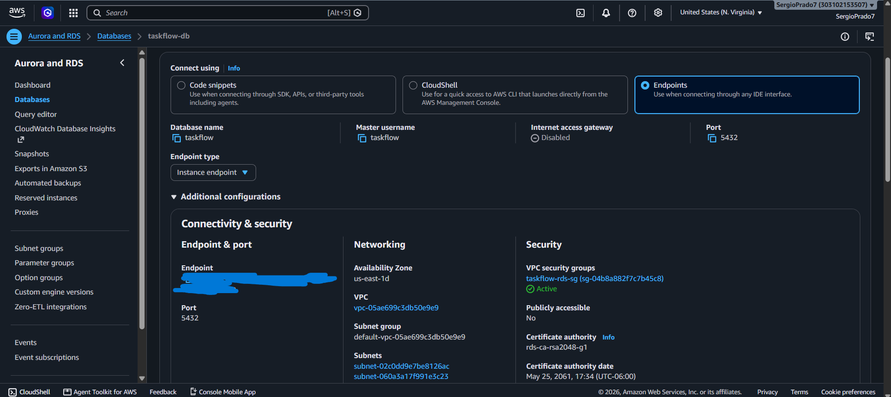</a>

> **Figura 24.** Detalles de conexión: base taskflow, puerto 5432, endpoint, VPC y grupo taskflow-rds-sg. Publicly accessible aparece en No. Comprueba el puerto y el acceso privado y la configuración de conectividad.

#### Resultado obtenido

La base PostgreSQL quedó disponible con acceso público deshabilitado. Se identificaron los datos necesarios para conectar la API desde la EC2.

#### Alcance y limitaciones

RDS quedó disponible y privado. No se registró cada opción del formulario, como almacenamiento, backups y protección de borrado.

---

### MP-10 · Conectar la API a RDS

#### ¿Qué se hizo?

Se generó un secreto para la firma de JWT con `openssl rand -hex 32` desde Git Bash. Después se intentó iniciar la API en la EC2 con el perfil `docker`, indicando el endpoint de RDS, el puerto, la base, el usuario, la contraseña y el secreto JWT como parámetros. El primer intento no funcionó, según el contexto de la captura. Se modificaron las reglas de entrada de `taskflow-rds-sg` para permitir tráfico PostgreSQL por el puerto 5432 desde otro grupo de seguridad y se volvió a lanzar la aplicación.

#### ¿Para qué sirve?

Esta configuración permite que la API utilice PostgreSQL en RDS en lugar de H2 dentro de la EC2. Las reglas de entrada controlan qué conexiones pueden llegar a la base. El secreto JWT se utiliza para firmar los tokens de autenticación; el comando genera ese secreto, no un token de inicio de sesión.

#### ¿Qué se vio?

> **Figura 30.** Generación del secreto para JWT mediante OpenSSL en el equipo local. Documenta el comando utilizado para generar el secreto.

> **Figura 31.** Primer intento de arranque con el perfil docker y los parámetros de conexión. La captura muestra el comando, sin detallar el error. Identifica el intento previo al ajuste de red.

> **Figura 32.** Confirmación del cambio de reglas de taskflow-rds-sg. Se observa una regla PostgreSQL con origen en otro grupo de seguridad y una segunda regla con una IP /32. Permite relacionar el cambio de acceso con el arranque posterior.

> **Figura 33.** Nuevo arranque: el log muestra una conexión PostgreSQL, versión de base 18.3, creación de tablas y el mensaje Started TaskflowApiApplication. Confirma la conexión a PostgreSQL y el arranque correcto.

> **Figura 34.** Swagger vuelve a mostrarse en el navegador después del arranque con RDS. Comprueba que la interfaz volvió a responder.

#### Resultado obtenido

La API logró iniciar con una conexión a PostgreSQL en RDS y Swagger volvió a estar disponible. Se reutilizó el JAR desplegado y se cambió su configuración de arranque para trabajar con la base externa.

#### Alcance y limitaciones

Se comprobó el arranque contra PostgreSQL. No se guardó el mensaje exacto del primer error ni una prueba de login posterior al cambio de base.

---

### Tabla A · El problema de conexión registrado

#### ¿Qué se hizo?

Se relacionó el primer arranque fallido con la modificación de las reglas de RDS y el arranque posterior.

#### ¿Para qué sirve?

Separar una sospecha de red de un error de credenciales evita cambiar el código cuando el problema está en el acceso a la base.

#### ¿Qué se vio?

| Situación | Evidencia | Interpretación y respuesta |
|---|---|---|
| Primer intento sin funcionar | Figura 31 y contexto aportado por el autor | No se guardó el log del error. No puede citarse un mensaje exacto como si se hubiera observado. |
| Ajuste de acceso a PostgreSQL | Figura 32: TCP 5432 desde otro security group; permanece también una regla IP /32 | Se habilitó una ruta de acceso autorizada a RDS. |
| Arranque posterior correcto | Figura 33: conexión PostgreSQL y mensaje Started TaskflowApiApplication | La aplicación logró conectarse después del ajuste. |
| Diagnóstico de referencia de la guía | Connect timed out | Es compatible con tráfico bloqueado o una ruta inaccesible, pero no quedó capturado en esta ejecución. |
| Alternativa que debe distinguirse | Connection refused o un fallo de autenticación | Un rechazo de conexión y unas credenciales inválidas se investigan de forma distinta; no se observaron en las evidencias aportadas. |

**Alcance y limitaciones.** La secuencia respalda un problema de acceso de red, sin permitir afirmar qué excepción exacta ocurrió. No se reproduce una Tabla A original adicional porque no se proporcionó su contenido completo.

## S3

---

### MP-9 · Guardar el JAR en S3

#### ¿Qué se hizo?

Se creó el bucket `taskflow-artefactos-sergioprado` y se subió el archivo `taskflow-api-3.0.0.jar`. Después se abrió la sección de propiedades del objeto, se copió su Object URL y se intentó acceder desde el navegador.

#### ¿Para qué sirve?

S3 permite almacenar archivos como objetos dentro de un bucket. En esta práctica se utilizó para conservar el JAR de la aplicación. La prueba con la Object URL permite comprobar si el archivo puede descargarse directamente sin autorización.

#### ¿Qué se vio?

> **Figura 25.** Pantalla inicial de Amazon S3 con la opción Create bucket. Ubica el servicio usado para almacenar el artefacto.

> **Figura 26.** Confirmación de creación del bucket taskflow-artefactos-sergioprado. Confirma que el contenedor de objetos fue creado.

> **Figura 27.** Carga del JAR al bucket en progreso. Documenta el envío del artefacto.

> **Figura 28.** Propiedades del JAR ya almacenado, con un tamaño de 63.2 MB y su Object URL. Confirma que el archivo quedó almacenado.

> **Figura 29.** Al abrir la Object URL, S3 devuelve AccessDenied en formato XML. Comprueba que la URL directa no autorizó la descarga.

#### Resultado obtenido

El JAR quedó almacenado en S3. El intento de acceso directo fue rechazado, por lo que no se pudo descargar mediante esa URL sin autorización.

#### Alcance y limitaciones

Se llegó a subir el JAR y comprobar AccessDenied. No se documentó una descarga mediante URL prefirmada; ese paso se omitió y no se comunicó un impedimento técnico.

## Integrador y limpieza

---

### TaskFlow viva en AWS · Smoke test

#### ¿Qué se hizo?

Se revisó el arranque, se abrió Swagger y se consultaron tareas. Después del cambio a RDS se volvió a abrir Swagger.

#### ¿Para qué sirve?

Un smoke test comprueba las funciones mínimas para saber si el despliegue puede utilizarse.

#### ¿Qué se vio?

| Comprobación | Resultado registrado |
|---|---|
| Arranque inicial | Started TaskflowApiApplication, figura 18. |
| Acceso desde navegador | Swagger visible, figura 19. |
| Lectura de tareas | GET /tasks, HTTP 200 y JSON, figura 20. |
| Arranque contra RDS | Conexión PostgreSQL y arranque completado, figura 33. |
| Acceso después de RDS | Swagger visible, figura 34. |

**Alcance y limitaciones.** El login inicial se indicó en el contexto de la captura; no hay respuesta de login independiente. No se registró un smoke test completo de escritura, lectura y borrado contra RDS.

---

### Topología · Contenido de infra/topologia-aws.md integrado en este documento

#### ¿Qué se hizo?

Se reconstruyó la topología a partir de las evidencias de EC2, RDS y S3.

#### ¿Para qué sirve?

El esquema ubica dónde corre la aplicación, dónde están los datos y qué tráfico necesita autorización.

#### ¿Qué se vio?

Las figuras 10, 12, 24, 28 y 32 muestran los componentes que sustentan esta reconstrucción.

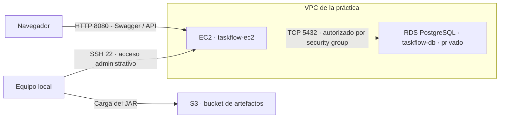

El endpoint se representa como `<ENDPOINT_RDS_OFUSCADO>`. La EC2 llega a la dirección privada de RDS dentro de la VPC; el navegador utiliza la API, no la base directamente. La restricción de SSH a la IP del equipo es la configuración prevista, pero no quedó capturada. La topología se integra aquí para mantener un solo documento; no se afirma que existiera previamente un archivo separado.

**Alcance y limitaciones.** Se documenta la arquitectura observada, sin una verificación actual de rutas o reglas en AWS.

---

### Checklist de limpieza · Día 3

#### ¿Qué se hizo?

Se dieron de baja los servicios de la primera jornada. El autor confirmó el cierre del entorno antes de continuar con los recursos nuevos.

#### ¿Para qué sirve?

Evitar cargos y retirar los servicios temporales que ya habían cumplido su función.

#### ¿Qué se vio?

La figura 44 muestra la terminación de una instancia anterior. La baja general de los servicios fue confirmada por el autor.

| Servicio de la práctica | Estado de cierre |
|---|---|
| EC2 anterior | **Eliminados** |
| RDS de la primera jornada | **Eliminados** |
| S3 de la primera jornada | **Eliminados** |

**Estado final.** Servicios eliminados al terminar las prácticas, según confirmación del autor. Las capturas conservan el funcionamiento anterior al cierre.
# Día 4 · Jueves 10 · DynamoDB, CodePipeline y CodeDeploy

## Preparación previa

---

### Prework · Preparación del repositorio y conexión con GitHub

#### ¿Qué se hizo?

Se preparó una copia de TaskFlow con un historial Git nuevo, eliminando las carpetas target, data y .git antes de crear el primer commit. Se configuró la rama main y el repositorio remoto SergioPrado7/taskflow-aws-sergioprado. Después se creó la conexión github-taskflow en AWS y se autorizó AWS Connector para ese repositorio.

#### ¿Para qué sirve?

El repositorio guarda el código que utilizará el pipeline. La conexión permite que AWS acceda al proyecto de GitHub para obtener sus cambios.

#### ¿Qué se vio?

> **Figura 35.** Creación del repositorio taskflow-aws-sergioprado en GitHub. Identifica el repositorio de origen.

> **Figura 36.** Limpieza de la copia local e inicio de un historial nuevo con el primer commit. Documenta un historial independiente para la práctica.

> **Figura 37.** Configuración de main, del remoto origin y del comando de push. Relaciona la copia local con el remoto.

> **Figura 38.** Sección Connections de Developer Tools antes de crear la conexión. Ubica el punto de configuración de la integración.

> **Figura 39.** Selección de GitHub como proveedor y del nombre github-taskflow. Identifica el proveedor y la conexión elegidos.

> **Figura 40.** Autorización limitada al repositorio taskflow-aws-sergioprado. Comprueba el alcance de la autorización al repositorio.

> **Figura 41.** La conexión github-taskflow aparece en estado Available en N. Virginia. Confirma que la conexión quedó lista para usarse.

#### Resultado obtenido

El proyecto quedó preparado como origen del pipeline y la conexión con GitHub quedó disponible.

#### Alcance y limitaciones

La conexión Available quedó comprobada. El pipeline posterior demuestra que el repositorio pudo utilizarse como origen.

## La EC2 otra vez

---

### Preparación · Relanzar la EC2

#### ¿Qué se hizo?

Después de eliminar la infraestructura anterior, se creó el rol taskflow-ec2-role y se lanzó otra instancia taskflow-ec2 de tipo t3.micro. La nueva instancia aparece encendida con una dirección IP pública distinta.

#### ¿Para qué sirve?

El rol permite asignar permisos a la instancia para trabajar con otros servicios de AWS. La nueva EC2 será el servidor que recibirá los despliegues de la aplicación.

#### ¿Qué se vio?

> **Figura 42.** Lista de roles IAM antes de crear el rol de la instancia. Documenta el estado previo a la creación del rol.

> **Figura 43.** Confirmación de creación de taskflow-ec2-role, con EC2 como entidad de confianza. Confirma la identidad de servicio preparada para EC2.

> **Figura 44.** Nueva instancia taskflow-ec2 en estado Running. También aparece la confirmación de terminación de la instancia anterior. Distingue la instancia nueva de la anterior.

#### Resultado obtenido

Se contó con una nueva EC2 en ejecución y con el rol creado para preparar el despliegue.

#### Alcance y limitaciones

Se observan el rol creado y la nueva instancia. Las dos novedades previstas son el instance profile taskflow-ec2-role y la etiqueta Name=taskflow-ec2. La etiqueta se observa también en el grupo de despliegue; no hay una captura del campo IAM Role de la instancia para verificar la asociación directamente.

## DynamoDB

---

### Preparación · Configurar AWS CLI

#### ¿Qué se hizo?

Se creó una clave de acceso para taskflow-admin y se descargó su archivo CSV, según el contexto de la captura. En Git Bash se ejecutó aws configure, se eligió us-east-1 como región y json como formato de salida. Después se desactivó el paginador y se ejecutó aws sts get-caller-identity.

#### ¿Para qué sirve?

La CLI permite realizar operaciones de AWS desde la terminal. La consulta de identidad sirve para comprobar con qué usuario se ejecutarán los comandos.

#### ¿Qué se vio?

> **Figura 45.** Sección de claves de acceso de taskflow-admin antes de crear la clave. Ubica el alta del acceso programático.

> **Figura 46.** Pantalla de recuperación de la clave de acceso y opción de descarga del CSV. Documenta la creación de las credenciales de la CLI.

> **Figura 47.** Configuración de AWS CLI y respuesta de get-caller-identity correspondiente a taskflow-admin. Comprueba qué identidad utilizó la CLI.

#### Resultado obtenido

La CLI quedó configurada y respondió con la identidad del usuario taskflow-admin.

#### Alcance y limitaciones

La identidad de la CLI quedó comprobada. Se conserva la captura original como evidencia de la configuración utilizada durante la práctica.

---

### MP-1 · Crear la tabla en DynamoDB

#### ¿Qué se hizo?

Se ejecutó aws dynamodb create-table para crear taskflow-eventos. Se definieron taskId como clave de partición y fechaHora como clave de ordenación, ambas de tipo String, con el modo PAY_PER_REQUEST.

#### ¿Para qué sirve?

La tabla permite guardar eventos asociados a una tarea. taskId agrupa los eventos de la misma tarea y fechaHora permite distinguirlos y ordenarlos dentro de ese grupo.

#### ¿Qué se vio?

> **Figura 48.** Comando de creación y respuesta de DynamoDB con el esquema de claves, el modo PAY_PER_REQUEST y el estado inicial CREATING. Confirma el esquema solicitado y el modo de capacidad.

#### Resultado obtenido

DynamoDB aceptó la creación de taskflow-eventos. Las operaciones de la siguiente práctica muestran que después pudo utilizarse.

#### Alcance y limitaciones

La tabla se creó con taskId y fechaHora. Las inserciones posteriores demuestran que estuvo operativa.

---

### MP-2 · Insertar y recuperar eventos

#### ¿Qué se hizo?

Se insertó un evento de tipo CREADA para T-001 con put-item y se revisó en la consola. Después se ejecutaron los comandos para registrar los cinco eventos de T-001 y T-002. Finalmente se recuperó un evento con get-item, indicando taskId y fechaHora.

#### ¿Para qué sirve?

Estas operaciones permiten registrar el historial de una tarea y recuperar un evento concreto mediante su clave completa. Cada evento incluye datos como el tipo de cambio, su autor y, en algunos casos, un detalle.

#### ¿Qué se vio?

> **Figura 49.** Inserción inicial del evento CREADA para T-001. Documenta una escritura en DynamoDB.

> **Figura 50.** La consola devuelve el evento registrado al explorar la tabla. Comprueba que el evento puede leerse desde la consola.

> **Figura 51.** Comandos put-item para los cinco eventos. El primer comando utiliza la misma clave del evento inicial y agrega su detalle. Registra las claves y tipos de eventos enviados.

> **Figura 52.** get-item devuelve el evento de T-001 con autor ana, tipo CREADA y el detalle de la tarea. Comprueba la recuperación mediante la clave completa.

#### Resultado obtenido

Se guardaron eventos y se comprobó la recuperación de uno de ellos tanto desde la consola como desde la CLI.

#### Alcance y limitaciones

Se registraron los cinco comandos y una recuperación correcta. No se aportó un conteo final de cinco elementos.

---

### MP-3 · Query contra scan

#### ¿Qué se hizo?

El registro muestra un scan de consola cuando había un evento, pero no incluye una comparación ejecutada entre query y scan.

#### ¿Para qué sirve?

La comparación distingue elementos devueltos, elementos evaluados y capacidad de lectura consumida. Query delimita la búsqueda por la clave de partición; scan recorre elementos y aplica el filtro después de leerlos.

#### ¿Qué se vio?

La figura 50 muestra un scan con 1 elemento devuelto, 1 evaluado y 2 RCU según la consola. Ese resultado aislado no permite comparar ambas operaciones ni trasladar los números del ejemplo de la guía a esta ejecución.

**Hasta dónde se llegó y qué lo impidió.** Se llegó a insertar y leer eventos. No se documentó la comparación ni se indicó el motivo concreto de su omisión.

---

### MP-4 · Modelar al revés

#### ¿Qué se hizo?

La tabla utilizada agrupa por taskId y ordena por fechaHora. No se registró una actividad de discusión o diseño adicional.

#### ¿Para qué sirve?

El diseño parte de las preguntas que necesita responder la aplicación. Para consultar los eventos de una tarea y un intervalo de fechas, esas claves encajan con el acceso previsto. Buscar eventos por autor o por tipo exigiría revisar otro índice o diseño.

#### ¿Qué se vio?

El esquema de claves de la figura 48 y el get-item de la figura 52. Son evidencia del modelo usado, no de una comparación de alternativas.

**Hasta dónde se llegó y qué lo impidió.** Se utilizó el modelo propuesto en la guía. No se aportó un razonamiento de diseño realizado durante la práctica ni el motivo de esa omisión.

## El pipeline

---

### Preparación del pipeline · Bucket de artefactos y flujo de despliegue

#### ¿Qué se hizo?

Se volvió a crear el bucket taskflow-artefactos-sergioprado en S3. Como apoyo para el proceso se incluyó el esquema del recorrido desde GitHub hasta la EC2.

#### ¿Para qué sirve?

El bucket sirve para almacenar artefactos de construcción. El esquema muestra cómo CodePipeline coordina la obtención del código, la construcción con CodeBuild y el despliegue con CodeDeploy.

#### ¿Qué se vio?

> **Figura 53.** Bucket taskflow-artefactos-sergioprado disponible en us-east-1. Identifica el almacenamiento preparado para artefactos.

> **Figura 54.** Recorrido del cambio desde GitHub hasta la API: permite relacionar cada servicio, archivo y hook con su responsabilidad en el despliegue.

**Cómo se lee la figura 54, paso por paso**

1. **El cambio empieza en GitHub.** Se hace commit y push a main. El pipeline obtiene esa revisión del repositorio; los archivos que solo existen en la computadora no forman parte del despliegue.
2. **CodePipeline coordina el recorrido.** Ejecuta Source, Build y Deploy en orden y pasa sus artefactos de una etapa a otra. Su función es coordinar; la compilación la realiza CodeBuild.
3. **CodeBuild lee buildspec.yml.** Ese archivo contiene las instrucciones para preparar Java, ejecutar Maven y seleccionar los archivos de salida. En el flujo de la guía se empaquetan el JAR, appspec.yml, taskflow.service y scripts. La evidencia del reporte confirma que los archivos se subieron; no muestra su contenido completo.
4. **S3 conserva el artefacto.** El paquete construido queda disponible para la etapa de despliegue. Así se entrega un resultado concreto de una construcción, con las instrucciones correspondientes a esa misma revisión.
5. **CodeDeploy selecciona la instancia.** La aplicación taskflow y el grupo taskflow-dg señalan el destino mediante la etiqueta Name=taskflow-ec2 y utilizan un rol de servicio para realizar el despliegue.
6. **El agente de la EC2 lee appspec.yml.** Este archivo indica qué copiar, a qué rutas y qué scripts ejecutar. Debe viajar en la raíz del artefacto porque el agente lo necesita junto con el JAR y los scripts de esa versión. Tenerlo únicamente en GitHub no lo pone a disposición del agente dentro del paquete. [Referencia de AppSpec de AWS](https://docs.aws.amazon.com/codedeploy/latest/userguide/reference-appspec-file.html).
7. **Los hooks aplican el cambio.** ApplicationStop detiene la versión anterior; Install copia los archivos según AppSpec; AfterInstall ajusta permisos; ApplicationStart arranca el servicio; ValidateService comprueba que responde. Install es una fase interna de copia, no uno de los cuatro scripts personalizados. En el primer despliegue no hay una revisión anterior para ApplicationStop. [Ciclo de vida de CodeDeploy](https://docs.aws.amazon.com/es_es/codedeploy/latest/userguide/reference-appspec-file-structure-hooks.html).
8. **systemd mantiene la API en ejecución.** taskflow.service define cómo arrancarla y su política de reinicio. El flujo termina al comprobar /info: en la figura 68 aparece la versión 3.0.1, evidencia de que el cambio llegó a la máquina.

El dibujo explica el diseño del flujo. Las figuras 65, 67 y 68 son las que muestran el resultado de la ejecución real.

#### Resultado obtenido

Se preparó el almacenamiento de artefactos y se identificó la función de cada componente del pipeline.

#### Alcance y limitaciones

Se documentó el bucket. Su nombre visible coincide con el usado en la Guía 1; no se afirma que cambiara el nombre. No hay captura del versionado ni del bucket concreto seleccionado como artifact store del pipeline.

---

### IAM para servicios

#### ¿Qué se hizo?

Se crearon los roles de EC2 y CodeDeploy y se configuró un pipeline que utilizó CodeBuild y CodeDeploy.

#### ¿Para qué sirve?

Los roles dan a cada servicio permisos para realizar su parte del proceso.

#### ¿Qué se vio?

| Pieza | Responsabilidad | Evidencia disponible |
|---|---|---|
| taskflow-ec2-role | Permitir a la instancia leer el artefacto; la guía propone AmazonS3ReadOnlyAccess | Creación del rol en figura 43; no se muestra la política adjunta. |
| taskflow-codedeploy-role | Permitir al servicio actuar sobre las instancias del grupo | Figuras 60 y 62. |
| Rol de CodeBuild | Leer la entrada, escribir logs y publicar el artefacto | Ejecuciones Build visibles; no se capturó el detalle del rol. |
| Rol de CodePipeline | Invocar y conectar las etapas | Ejecuciones completas; no se capturó el detalle del rol. |

**Alcance y limitaciones.** El fallo inicial fue atribuido a permisos por el autor, pero no se conserva el mensaje de acceso denegado ni la política que se cambió.

---

### MP-5 · Instalar el agente de CodeDeploy

#### ¿Qué se hizo?

Dentro de la EC2 se ejecutó sudo dnf install -y ruby wget y se instaló el agente de CodeDeploy. Después se revisó su estado con sudo systemctl status codedeploy-agent.

#### ¿Para qué sirve?

El agente recibe y ejecuta las instrucciones del despliegue en la instancia. Es el componente que permite aplicar los archivos y scripts enviados por CodeDeploy.

#### ¿Qué se vio?

> **Figura 55.** Instalación de Ruby y sus dependencias; wget ya estaba instalado. Documenta las dependencias del agente.

> **Figura 56.** El servicio codedeploy-agent aparece como active (running) y enabled. Confirma que la instancia puede ejecutar el agente.

#### Resultado obtenido

El agente quedó instalado y en ejecución dentro de la nueva EC2.

#### Alcance y limitaciones

El servicio aparece active (running). No se aportó una captura independiente de la primera línea del instalador.

---

### MP-6 · taskflow.service

#### ¿Qué se hizo?

Se incorporó taskflow.service al proyecto junto con los archivos del pipeline.

#### ¿Para qué sirve?

En el diseño de la guía, systemd ejecuta la API con ec2-user desde /opt/taskflow y puede reiniciarla si el proceso termina. La unidad define el arranque; no compila el proyecto.

#### ¿Qué se vio?

La figura 57 muestra la selección del archivo y la figura 59 su commit. Las evidencias se agrupan al final de MP-8 porque se prepararon juntas.

**Alcance y limitaciones.** Se comprobó que el archivo se versionó. No hay captura de su contenido ni una prueba separada del reinicio automático.

---

### MP-7 · buildspec.yml

#### ¿Qué se hizo?

Se incorporó buildspec.yml al repositorio para que CodeBuild utilizara las instrucciones de construcción.

#### ¿Para qué sirve?

Define la preparación del entorno, los comandos de Maven y los archivos que se entregan como artefacto. En el material de la guía se utiliza Java Corretto 21 y se prepara un nombre de JAR estable para el despliegue.

#### ¿Qué se vio?

El archivo seleccionado y publicado en las figuras 57 y 59; las construcciones correctas aparecen en las figuras 65 y 67.

**Alcance y limitaciones.** Build terminó correctamente. No se conserva el contenido completo de buildspec.yml ni el log de Maven para detallar cada comando ejecutado.

---

### MP-8 · appspec.yml y los cuatro hooks

#### ¿Qué se hizo?

Se agregaron appspec.yml y los cuatro scripts; se marcaron como ejecutables con git update-index --chmod=+x y se publicaron en Git.

#### ¿Para qué sirve?

AppSpec relaciona archivos, destinos y eventos del despliegue. Los scripts convierten las acciones manuales en pasos repetibles.

#### ¿Qué se vio?

> **Figura 57.** Selección de los archivos del pipeline y la carpeta scripts para incorporarlos al proyecto. Relaciona los archivos entregados con la automatización.

> **Figura 58.** Git muestra el modo 100755 en arrancar.sh, parar.sh, permisos.sh y verificar.sh, confirmando el permiso de ejecución. Comprueba que Git conserva el permiso de ejecución.

> **Figura 59.** Commits y pushes de los archivos de configuración. También se registra la creación de .gitignore, vacío en ese momento. Confirma que la configuración se publicó.

**Alcance y limitaciones.** Git muestra 100755 para los cuatro scripts. La captura de .gitignore muestra un archivo vacío; no se afirma que ya excluyera target o data. No se registró una prueba aislada de cada hook.

---

### MP-9 · Configurar y ejecutar el pipeline

#### ¿Qué se hizo?

Se creó taskflow-codedeploy-role, la aplicación taskflow en CodeDeploy y el grupo taskflow-dg. El grupo se configuró con despliegue In-place y la etiqueta Name=taskflow-ec2. Se registró un primer pipeline llamado taskflow-pipeline y luego se continuó con paginaapi. La etapa Build falló inicialmente; el contexto de la captura indica un problema de permisos. Tras los ajustes y reintentos, las tres etapas terminaron correctamente.

#### ¿Para qué sirve?

CodePipeline coordina las etapas Source, Build y Deploy. Source obtiene el código de GitHub, CodeBuild lo construye y CodeDeploy lo instala en la instancia seleccionada por su etiqueta.

#### ¿Qué se vio?

> **Figura 60.** Confirmación de creación del rol taskflow-codedeploy-role. Documenta el rol creado para CodeDeploy.

> **Figura 61.** Aplicación taskflow creada para la plataforma EC2/On-premises. Identifica la aplicación de despliegue.

> **Figura 62.** Grupo taskflow-dg creado con el rol de servicio, despliegue In-place y etiqueta Name=taskflow-ec2. Comprueba el destino seleccionado y el rol del grupo.

> **Figura 63.** Creación de taskflow-pipeline. En esta captura Source está en progreso y las demás etapas aún no se ejecutan. Distingue la creación del pipeline de su ejecución completa.

> **Figura 64.** En paginaapi, Source termina correctamente, Build falla y Deploy no se ejecuta. Ubica el fallo en Build, antes del despliegue.

> **Figura 65.** Después de los reintentos, Source, Build y Deploy muestran All actions succeeded para la misma ejecución. Comprueba la recuperación de las tres etapas.

#### Resultado obtenido

El pipeline paginaapi completó las tres etapas. Las capturas muestran la recuperación del fallo, aunque no detallan los permisos que se modificaron.

#### Alcance y limitaciones

Se comprobó el pipeline completo. El nombre final observado es paginaapi. No se atribuye el fallo de Build a un hook de CodeDeploy.

## Integrador y limpieza

---

### Integrador · Un cambio que se despliega automáticamente

#### ¿Qué se hizo?

Se modificó el controlador para mostrar la versión 3.0.1 y se envió el cambio al repositorio. El pipeline paginaapi detectó el commit y ejecutó otra construcción y despliegue. Al terminar, se abrió /info en la dirección pública de la EC2.

#### ¿Para qué sirve?

Esta prueba conecta el cambio en el código con el resultado publicado. Revisar /info permite comprobar que la nueva versión llegó al servidor, además de verificar los estados del pipeline.

#### ¿Qué se vio?

> **Figura 66.** Nueva ejecución para el commit de modificación del controlador: Source completado y Build en progreso. Deploy todavía muestra la ejecución anterior. Permite distinguir una ejecución nueva de la anterior.

> **Figura 67.** Las tres etapas completadas para el commit del cambio en el controlador. Relaciona el mismo commit con las tres etapas correctas.

> **Figura 68.** El endpoint /info devuelve version 3.0.1 y app taskflow-api desde la nueva EC2. Confirma que el cambio llegó a la aplicación.

#### Resultado obtenido

El cambio llegó a la aplicación desplegada. La respuesta de /info confirmó la versión 3.0.1 después de completar el pipeline.

#### Alcance y limitaciones

La versión 3.0.1 quedó comprobada en /info. Las capturas corresponden a la ejecución de la práctica, no a la disponibilidad actual.

---

### Rómpelo a propósito y lee el hook que falló

#### ¿Qué se hizo?

Se registró un fallo de Build y reintentos del pipeline. No se documentó una modificación intencional para romper un hook.

#### ¿Para qué sirve?

La prueba permite reconocer la fase exacta de un despliegue fallido, leer la salida del script y corregir la causa.

#### ¿Qué se vio?

Build falló en la figura 64 y las tres etapas terminaron correctamente en la figura 65. No se muestra un evento de CodeDeploy con un hook fallido ni su salida.

**Hasta dónde se llegó y qué lo impidió.** Se recuperó el pipeline y se completó el despliegue. No se indicó por qué se omitió la prueba intencional; no puede atribuirse el fallo a ApplicationStart o ValidateService sin su evidencia.

---

### Checklist de limpieza · Día 4

#### ¿Qué se hizo?

Al finalizar las prácticas y guardar las evidencias, se dieron de baja todos los servicios utilizados. El autor confirmó que el entorno ya está fuera de servicio.

#### ¿Para qué sirve?

Evitar costos posteriores y mantener cerrado un entorno temporal cuya documentación está en un repositorio público.

#### ¿Qué se vio?

Las figuras 65, 67 y 68 conservan el resultado exitoso anterior al cierre. La baja final fue confirmada por el autor.

| Servicio de la práctica | Estado de cierre |
|---|---|
| EC2 utilizada para el pipeline | **Eliminados** |
| DynamoDB | **Eliminados** |
| S3 utilizado para los artefactos | **Eliminados** |
| CodePipeline, CodeBuild y CodeDeploy | **Eliminados** |

**Estado final.** Servicios eliminados al terminar las prácticas, según confirmación del autor. Las capturas conservan el funcionamiento anterior al cierre.
# Cinco preguntas · Explicación con palabras propias

## 1. ¿Por qué RDS no tiene IP pública y cómo llega la EC2?

La base guarda los datos y no necesita aceptar conexiones directas desde internet. La EC2 se conecta al endpoint de RDS, que permite alcanzar su dirección privada dentro de la VPC. Para que pase el tráfico, deben permitirlo las rutas y las reglas de red; en la práctica se agregó TCP 5432 desde el security group de la EC2. Los usuarios entran a la API y esta consulta la base. [RDS dentro de una VPC](https://docs.aws.amazon.com/AmazonRDS/latest/UserGuide/USER_VPC.WorkingWithRDSInstanceinaVPC.html).

## 2. ¿Qué habría pasado si se dejaba SSH abierto al mundo?

Cualquier dirección de internet habría podido intentar conectarse al puerto 22. Eso no significa acceso automático, porque sigue existiendo la autenticación, pero expone el servicio a escaneos e intentos de intrusión. Limitar el origen a la IP del equipo reduce quién puede iniciar esos intentos. Las capturas no permiten asegurar cuál fue la regla inicial configurada.

## 3. ¿Qué midió la comparación de query contra scan?

No quedó registrada una comparación propia. Solo se conserva el scan de la figura 50: 1 elemento devuelto, 1 evaluado y 2 RCU indicadas por la consola. Una comparación completa revisaría Count, ScannedCount y ConsumedCapacity, además de mantener condiciones comparables. Count cuenta resultados y ScannedCount elementos evaluados antes del filtro; la capacidad depende de los datos leídos y la consistencia, no solo del número de resultados. Scan puede leer datos que después descarta. No se presentan las cifras del ejemplo de la guía como una medición personal. [Funcionamiento de Scan](https://docs.aws.amazon.com/amazondynamodb/latest/developerguide/Scan.html).

## 4. ¿Qué hace cada pieza del pipeline y por qué viaja appspec.yml?

CodePipeline coordina; CodeBuild usa buildspec.yml para construir; S3 conserva los artefactos; CodeDeploy dirige su instalación en EC2. El agente lee appspec.yml para saber qué archivos copiar y qué scripts ejecutar. AppSpec viaja dentro del paquete para que las instrucciones y el JAR pertenezcan a la misma revisión y estén disponibles en el destino. La figura 54 desarrolla ese recorrido. [AppSpec en la revisión de la aplicación](https://aws.amazon.com/codedeploy/faqs/).

## 5. ¿En qué hook queda cada comando manual del miércoles?

| Acción manual | Automatización del jueves | Hook o fase |
|---|---|---|
| Detener Java con kill | parar.sh detiene el servicio con systemctl stop taskflow | ApplicationStop |
| Copiar el JAR con scp | El agente copia lo definido en files de appspec.yml | Install, fase interna; no es un script personalizado |
| Ajustar dueño y permisos con chown | permisos.sh prepara permisos y el servicio | AfterInstall |
| Arrancar con nohup java -jar | arrancar.sh utiliza systemctl start taskflow | ApplicationStart |
| Abrir la API o hacer curl para comprobarla | verificar.sh consulta /info y devuelve éxito o error | ValidateService |
| Empaquetar con Maven en el equipo local | CodeBuild ejecuta la construcción según buildspec.yml | Build; ocurre antes de CodeDeploy |

Esta tabla explica el diseño de los scripts entregados en la guía. Las capturas confirman sus nombres, permisos y un despliegue correcto; no muestran el contenido de cada uno. En el primer despliegue ApplicationStop se omite porque no existe una revisión anterior. [Hooks de CodeDeploy](https://docs.aws.amazon.com/es_es/codedeploy/latest/userguide/reference-appspec-file-structure-hooks.html).

# Publicación y protección de datos

Son evidencias de la ejecución de las prácticas y no representan servicios actualmente disponibles: todos los servicios utilizados ya fueron dados de baja por seguridad y costos.

